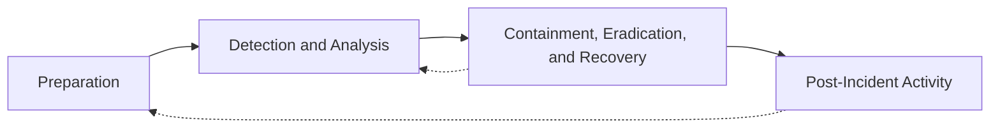

### Overview

* **SOC** (Security Operations Center) : A team of analysts monitoring the security of the organisation.
* **An event:** Is anything observable on a system (a login, a file write, a network connection); 
* **An incident** is an event, or set of events, confirmed to have violated security policy or caused actual/potential harm, every incident starts as an event.

# Two Pillars of Incident Handling

## Incident Response (Technical Aspect)

**Primary Question**: What happened?

The technical portion responsible for understanding the scope of the incident.

**Common Detection Sources:**

* **EDR or AV Alert**: Alerts for anomalous activity on specific hosts.
* **Network Tap Alert**: Alerts for anomalous network activity
* **SIEM Alert**: Custom rules created by analysts in Security Information and Event Management systems

**Digital Forensics Activities:**

* Recovering hard disk from infected host to investigate malware infection vectors
* Recovering volatile memory (RAM) data to investigate malware behavior
* Recovering system and network logs to trace malware propagation

## Incident Management (Process Aspect)

**Primary Question**: How do we respond to what happened?

**Key Responsibilities**:

* Triage and update incident severity as new information becomes available
* Guide actions through playbooks
* Decide containment, eradication, and recovery actions
* Manage internal and external communications
* Document all actions and their effects
* Close incident and extract lessons learned for process improvement

## Incident Severity Levels

| **Level** | **Team** | **Description** |
| ----- | ---- | -----|
| Level 1: SOC Incident | SOC Analyst(s) | Isolated events requiring purely technical approach (e.g., updating mail filtering rules). Happen multiple times daily, quick resolution |
| Level 2: CERT Incident | Multiple SOC Analysts | Concern requires additional investigation but alarm not yet raised. Investigate user interaction and malware behavior. Escalates to CSIRT if users interacted with malware|
| Level 3: CSIRT Incident | Entire SOC + Forensic Team | High alert status. Full focus on single incident. Uncover full scope, contain spread, eradicate from hosts, recover affected systems. Escalates to CMT if scope exceeds containment|
| Level 4: CMT Incident | Executive Suite, Legal, Communications, External Parties (Regulator/Police) | Full-scale cyber crisis. All hands on deck. May authorize "nuclear" actions like taking entire organization offline |

## The differents roles during an incident

| Role | Description |
|---|---|
| **SOC Analyst** | First line of defense; triages events/alerts and is usually first involved when something escalates to an incident. |
| **SOC Lead** | Manages the SOC team and decides when an alert gets escalated to incident status. |
| **Forensic Analyst** | Investigates what happened post-incident by examining artifacts (memory, disk, etc.). |
| **Malware Analyst** | Forensic specialist who reverse-engineers malware to extract IoCs. |
| **Threat Hunter** | Proactively searches for undetected threats and builds new detection rules from the findings. |
| **First Responder** | Often a non-security team (e.g. product) that notices something wrong first; responsible for not destroying evidence before handing off. |
| **Security Engineer** | Owns security for a specific system/division; acts as SME during incidents and feeds logs to the SOC. |
| **Information Security Officer (ISO)** | Division-level security owner, more management-focused; bridges IR team and the affected business unit. |
| **Incident Manager** | Runs the IR process end-to-end — documentation, coordination, ensuring process is followed (not technical hands-on-keyboard). |
| **Product Owner** | SME for their product/system when it's affected by an incident, especially relevant in Agile/continuously-deployed environments. |
| **Subject Matter Expert (SME)** | Ad hoc technical expert pulled in based on what system/technology the incident touches. |
| **Crisis Manager** | Executive (CIO/COO-level) who leads the Crisis Management Team during a severe incident. |
| **Executive** | C-suite (CEO/COO/CIO/CTO/CISO) involved only when severity requires it. |

### The process of Incident Management

Based on the [NIST Incident Management](https://nvlpubs.nist.gov/nistpubs/specialpublications/nist.sp.800-61r2.pdf) process

**Note**: Phases 2 (Detection and Analysis) and 3 (Containment, Eradication, and Recovery) are cyclic because investigation and action occur concurrently you cannot wait for full understanding before taking action.

### Phase 1: Preparation

Better preparation reduces mistakes during incidents.

* Identify and document key stakeholders and call trees that will be used during an incident
* Create and update playbooks that aid the team in following a set process for incidents with a known nature
* Exercise the team's ability to deal with an incident through tabletop exercises and cyber war games
* Continuously perform threat hunting to help create new alert rules based on modern attacker techniques

### Phase 2: Detection and Analysis

Answer "what has happened?" Blue team works to understand scope and provide information to incident manager.

* Reviewing alerts in the AV, EDR, and SIEM dashboards
* Performing a forensic investigation of artefacts both on systems and the network
* Analysing malware that is discovered to better understand how it works and create new signatures that can be used to identify it.

### Phase 3: Containment, Eradication, and Recovery

Primary phase for dealing with the incident once scope is understood.

* Containment: Actions taken to "stop the bleed". These are actions meant to stop the incident from growing larger.
* Eradication: Actions taken to eradicate the threat actor from the estate.
* Recovery: Actions taken to recover the environment allow the organisation to go back to Business as Usual (BAU).

### Phase 4: Post-Incident Activity

Evaluate what happened to learn lessons and improve future incident handling processes.

# Common Pitfalls 

### Insufficient Hardening

Configurations that deviate from security best practices remain post-deployment, creating vulnerabilities

### Insufficient Logging

Incidents detected later when impact already exists; inaccurate scope determination

### Insufficient- and Over-Alerting

This is why threat hunting is important. Threat hunting helps to identify information that can be converted into new alerts that would let the team know when there is something worth investigating. Threat hunting should therefore be careful not just to create new alerts, but to ensure that their signal-to-noise ratio is optimised.

### Insufficient Determination of Incident Scope

A big mistake that often happens during incident response and management is not understanding the incident scope. While it is often impossible to fully understand the incident scope, best efforts should be made. 

### Insufficient Backups

In the event that an incident results in disruptive actions such as ransomware being deployed, the only saving grace is backups that can be used to recover the estate. However, if backup processes and policies were not clearly established and followed, it would not be possible to recover from the incident.

