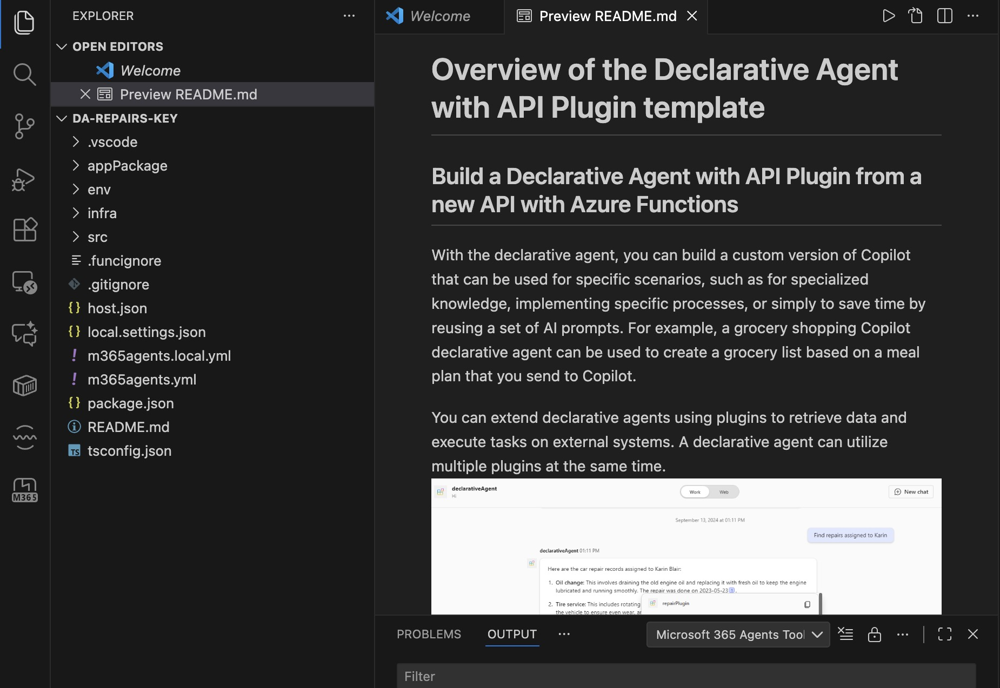

# Securing APIs

**Learning objectives** 

* Identify how an API is secured
* Design a secure way to integrate an API plugin for Microsoft 365 Copilot with an API
* Integrate an API plugin with an API secured with an API key
* Integrate an API plugin with an API secured with OAuth2
* Run the API plugin in Microsoft 365 Copilot to validate the results


##  Two common ways of how APIs are secured.

* **One of the common ways to secure APIs is by using API keys**: API keys are arbitrary strings that API owners issue to grant you access to the API


**Microsoft 365 Copilot supports passing API keys as:**

JSON Web Token (JWT)

``` json
GET https://api.contoso.com/orders
Authorization: Bearer API_KEY
```

Query string parameter

``` JSON
GET https://api.contoso.com/orders?api_key=API_KEY
```

Custom header

``` json
GET https://api.contoso.com/orders
X-API-Key: API_KEY
```


### Exercise - Integrate an API plugin with an API secured with a key

API plugins for Microsoft 365 Copilot allow you to integrate with APIs secured with a key. You keep the API key secure by registering it in the Teams vault. At runtime, Microsoft 365 Copilot executes your plugin, retrieves the API key from the vault, and uses it to call the API. By following this process, the API key stays secure and is never exposed to the client.

**Before you start: prerequisites**

#### Create a new project

Creating a new API plugin for Microsoft 365 Copilot. Open Visual Studio Code.

I needed these installed/ready first, or the steps below will fail:

* Visual Studio Code - Download from [Visual Code](code.visualstudio.com).
* Node.js (LTS version) — required to run the project.
* The **"Microsoft 365 Agents Toolkit" extension** 
* A **Microsoft 365 tenant/account with Copilot enabled** — this is usually provided to you as part of the exercise.

**Enabling Copilot:**
Get a tenant as regular user with Free Trial Version (if you don't have one) - This is for regular users.

1. Go to the [Microsoft 365 - Office 365 E5 Trial](https://www.microsoft.com/fr-be/microsoft-365/enterprise/office-365-plans-and-pricing?market=be) 
2. Enable custom app upload/sideloading (needed for testing your agent).
_This is the setting that actually matters for the exercise (letting VS Code push your test agent into Copilot):_

1. Go to the Microsoft 365 [admin center](https://admin.microsoft.com
) 
2. Sign in as the Global Admin
3. Navigate to **Settings → Integrated apps**
4. On the right, click Upload custom apps
5. Make sure sideloading/custom app deployment is allowed for your test account — for a Developer Program tenant this is typically already on

### In Visual Studio Code:

1. In the Activity Bar (side bar), activate the Microsoft 365 Agents Toolkit extension. _That's the thin vertical strip of icons on the far left edge of VS Code. After installing the extension, you'll see a new icon there. it usually looks like a small logo/robot-ish icon. Click it. This opens the "Microsoft 365 Agents Toolkit" panel._

2. In the Microsoft 365 Agents Toolkit extension panel, choose **Create a New App**.
3. From the list of project templates, choose **"Declarative Agent"**.
5. Choose the **Add Action** option.
6. Choose the Start with a **new API** option.
7. From the list of authentication types, choose **API Key**.
8. As the programming language, choose **TypeScript**.
9. Choose a folder to store your project.
10. Name your project **da-repairs-key**.





### Examine the API key authentication configuration

First, have a look at how API key authentication is defined in the API definition.

**In Visual Studio Code:**

1. Open the appPackage/apiSpecificationFile/repair.yml file. This file contains the OpenAPI definition for the API.
1. In the components.securitySchemes section, notice the apiKey property:

``` yaml
components:
  securitySchemes:
    apiKey:
      type: apiKey
      in: header
      name: X-API-Key
```
      
The property defines a security scheme that uses the API key as a header in the authorization request header.

1. Locate the paths./repairs.get.security property. Notice that it references the apiKey security scheme.

``` yaml
paths:
  /repairs:
    get:
      operationId: listRepairs
      summary: List all repairs
      description: Returns a list of repairs with their details and images
      parameters:
        - name: assignedTo
          in: query
          description: Filter repairs by who they're assigned to
          schema:
            type: string
          required: false
      security:
        - apiKey: []
```

### Examine the API implementation

Next, see how the API validates the API key on each request.

**In Visual Studio Code:**

1. Open the **src/functions/repairs.ts** file.
1. In the repairs handler function, locate the following line which rejects all unauthorized requests:

``` typescript
 // Check if the request is authorized.
  if (!isApiKeyValid(req)) {
    // Return 401 Unauthorized response.
    return {
      status: 401,
    };
  }
```

1. The isApiKeyValid function is implemented further in the repairs.ts file:

``` typescript
function isApiKeyValid(req: HttpRequest): boolean {
  const apiKey = req.headers.get("X-API-Key")?.trim();
  return apiKey === process.env.API_KEY;
}
```

This code shows a simplistic implementation of API key security, but it illustrates how API key security works in practice.

### Examine the vault task configuration

In this project, I use Microsoft 365 Agents Toolkit to add the API key to the vault. Microsoft 365 Agents Toolkit registers the API key in the vault using a special task in the project's configuration.

**In Visual Studio Code:**

1. Open the **m365agents.local.yml** file.
2. In the provision section, locate the apiKey/register task.

``` yaml
  # Register API KEY
  - uses: apiKey/register
    with:
      # Name of the API Key
      name: apiKey
      # Value of the API Key
      primaryClientSecret: ${{SECRET_API_KEY}}
      # app ID
      appId: ${{TEAMS_APP_ID}}
      # Path to OpenAPI description document
      apiSpecPath: ./appPackage/apiSpecificationFile/repair.yml
    # Write the registration information of API Key into environment file for
    # the specified environment variable(s).
    writeToEnvironmentFile:
      registrationId: APIKEY_REGISTRATION_ID
      
```

The task takes the value of the `SECRET_API_KEY` project variable, stored in the env/.env.local.user file and registers it in the vault. Then, it takes the vault entry ID and writes it to the environment file env/.env.local. The outcome of this task is an environment variable named `APIKEY_REGISTRATION_ID`. Microsoft 365 Agents Toolkit writes the value of this variable to the appPackages/ai-plugin.json file that contains the plugin definition. At runtime, the declarative agent that loads the API plugin, uses this ID to retrieve the API key from the vault, and call the API securely.
      
      

