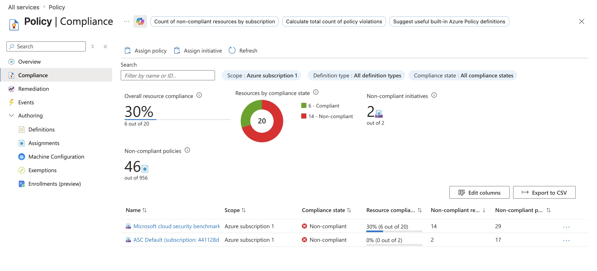
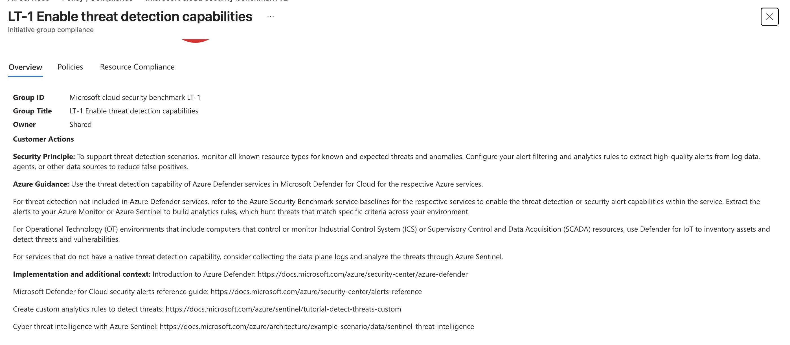
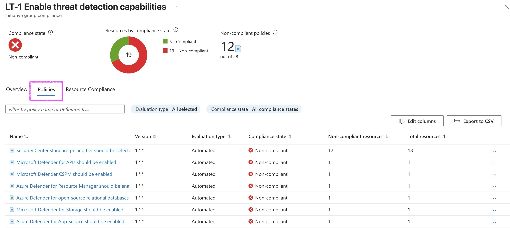

# Azure Policy definitions

Configuring a security control once doesn't mean it stays enforced. A storage account deployed today with HTTPS-only enabled can coexist with a storage account deployed next week that allows HTTP traffic unless you implement preventive governance controls. 

## Key definitions
* The **policy effect** determines what happens when a resource evaluation detects a policy violation.
* **Assign policy:** Assign one Azure Policy.
* **Assign initiative:** Assign a group of related policies (a policy set) in one assignment.
* **Policy** = one rule. **Initiative** = multiple rules managed together.
* **Locks** prevent deletion or modification of critical resources, understand lock inheritance behavior, and control who can create and remove locks.


### Azure Policy supports several effects, but four are essential for security governance workflows:


| Effect | What it does | When to use it |
| ------ | ---- | ---- |
| **Audit** | Evaluates the resource and marks it noncompliant in the compliance dashboard but takes no other action | Phase 1 of a rollout discover noncompliant resources without disrupting operations |
| **Deny** | Blocks the resource creation or update request at the Azure Resource Manager (ARM) layer before the resource is created; the request returns an error | Phase 2 of a rollout enforce the policy after remediating existing resources |
| **DeployIfNotExists** | Evaluates whether a related resource or setting exists; if it doesn't, deploys it automatically | Configurations that need to be provisioned alongside a resource (example: deploying diagnostic settings on every VM) |
| **Modify** | Automatically adds, updates, or removes a tag or property on a resource at creation or update time | Enforcing resource tagging standards or default configurations |


With the **Deny effect**, Azure blocks the resource creation or update request entirely. When a developer attempts to deploy a storage account with HTTP enabled, the ARM template deployment fails immediately with an error message referencing the policy. The policy prevents new noncompliant resources from entering the environment.

!!! note "Audit-First"

    Use the Audit-first rollout pattern: assign a policy with the Audit effect, review the compliance results, communicate the findings to application teams, and then switch the effect to Deny after remediating the existing noncompliant resources.
    
 
**Policy assignments** inherit through the Azure resource hierarchy: **management group → subscription → resource group → resource**. The scope you choose determines which resources the policy evaluates.

Assigning a policy at the management group scope covers every subscription within that management group, including new subscriptions added in the future. For organization-wide baseline controls, this approach works best.

Assigning at the **subscription** scope only covers resources within that subscription. New subscriptions created later aren't covered automatically.

**Resource group** and resource scopes exist but are rarely used for security policies. Security controls typically apply broadly rather than to individual resources.

**Exclusions** let you carve out exceptions to a management group-level assignment. When a specific subscription, resource group, or resource has a justified exception, you exclude that scope from the assignment. For example, byteGirl might exclude a sandbox subscription used for proof-of-concept testing from the production security policies. Use exclusions sparingly and document the business justification.

## Built-in definitions

**Location**: Policy → Definitions → filtering by the Category field. The "Security Center" category contains security-focused definitions, while categories like "SQL," "Storage," and "Key Vault" contain service-specific policies.

### Key built-in definitions for a security baseline include:


* "**Transparent data encryption on SQL databases should be enabled:**" Audit or Deny effect; targets `Microsoft.Sql/servers/databases` resources. Detects SQL databases without TDE encryption.
* "**Secure transfer to storage accounts should be enabled:**" Audit or Deny effect; targets `Microsoft.Storage/storageAccounts` resources. Blocks storage accounts that allow HTTP traffic.
* "**Storage accounts should restrict network access:**" Audit effect; evaluates storage account network rules to ensure public access is limited.
* "**Azure Key Vault should use private link:**" Audit effect; detects Key Vaults exposed to the public internet.
* "**Diagnostic logs in Azure Key Vault should be enabled**" AuditIfNotExists effect; checks whether Key Vault diagnostic settings are configured.

The [**Microsoft Cloud Security Benchmark**](https://learn.microsoft.com/en-us/security/benchmark/azure/overview) initiative contains dozens of security definitions covering compute, networking, data, identity, and privileged access. Assigning an initiative is more efficient than assigning definitions one by one, and it ensures all related controls deploy together.

## Assign a built-in initiative using Microsoft Cloud Security Benchmark


1. In the Azure portal, go to **All services →  Policy → Assignments → + Assign initiative.**
2. Under **Scope**, select the ellipsis (`...`) and choose the management group that covers all byteGirl subscriptions. This ensures every subscription inherits the assignment.
3. Under **Initiative definition**, search for `"Microsoft Cloud Security Benchmark"` and select it from the built-in initiative list.
4. Under **Parameters**, review the default parameter values. Most built-in definitions default to the Audit effect for initial rollouts. Override individual policy parameters if needed (for example, changing a specific definition from Audit to Deny).
5. Under **Remediation**, leave the checkbox unchecked for an Audit rollout. Remediation tasks apply to policies with DeployIfNotExists or Modify effects, which you configure after the initial assessment phase.
6. Under **Non-compliance messages**, optionally enter a custom message that appears when a resource is blocked by a Deny policy. For example: "This resource configuration violates byteGirl security policy. Contact security@bytegirl.be for assistance."
7. Review the assignment details and select Create.

	!!! note
	
	    After the assignment completes, Azure begins evaluating all resources within the scope during the next policy evaluation cycle. This process runs automatically every 24 hours.

	**To view compliance results:**

8. Go to **Policy → Compliance** to open the compliance dashboard.
9. The overall compliance percentage shows the fraction of resources meeting all assigned policies. A lower percentage indicates more noncompliant resources.
10. Select a specific policy definition to see the list of noncompliant resources with their reason code and location.

### Review the compliance dashboard for byteGirl's findings

I review the compliance dashboard and I discover significant gaps.



### How to read it?

Example:




This screen is not a recommendation that you enable with one button. It is a security benchmark control (LT-1) that groups several recommendations together.


* **LT-1** = Security control (Enable threat detection capabilities).
* **Customer Actions** = What Microsoft recommends you do.
* **Azure Guidance** = Services to use (Defender for Cloud, Microsoft Sentinel, Azure Monitor, etc.).
* **Policies tab** = Shows the individual policies/recommendations that make up this control.
* **Resource Compliance** = Shows which resources are compliant or non-compliant.

### How to remediate? 



1. Open the **Policies** tab.
2. Click a policy that is **Non-compliant**.
3. Read the remediation message.
4. Apply the required configuration (for example, enable a Defender plan, turn on diagnostic logs, or enable a security feature).
5. If available, click Remediate to let Azure fix it automatically.

(**Note to myself**: Go deeper in this later)

## Anatomy of 

A custom policy definition uses a JSON (JavaScript Object Notation) structure with three core components: **mode, parameters, and policyRule**. Understanding each component helps me build definitions that enforce exactly what my organization requires.

```JSON

{
  "properties": {
    "displayName": "Storage accounts must use the approved Log Analytics workspace",
    "description": "Ensures diagnostic settings on storage accounts send logs to the byteGirl central Log Analytics workspace.",
    "mode": "All",
    "parameters": {
      "approvedWorkspaceId": {
        "type": "String",
        "metadata": {
          "displayName": "Approved Log Analytics workspace ID",
          "description": "The resource ID of the required Log Analytics workspace."
        }
      },
      "effect": {
        "type": "String",
        "defaultValue": "AuditIfNotExists",
        "allowedValues": ["AuditIfNotExists", "Disabled"]
      }
    },
    "policyRule": {
      "if": {
        "field": "type",
        "equals": "Microsoft.Storage/storageAccounts"
      },
      "then": {
        "effect": "[parameters('effect')]",
        "details": {
          "type": "Microsoft.Insights/diagnosticSettings",
          "existenceCondition": {
            "field": "Microsoft.Insights/diagnosticSettings/workspaceId",
            "equals": "[parameters('approvedWorkspaceId')]"
          }
        }
      }
    }
  }
}

```

The **mode** property determines which resource types the policy evaluates. Use `"All"` to evaluate all resource types, including those without tags and location support, such as diagnostic settings and network security rules. Use `"Indexed"` to evaluate only resource types that support tags and location, which is appropriate for policies that check tag compliance or regional restrictions.

**Parameters** make the definition reusable across different environments and scopes. The `approvedWorkspaceId` parameter lets you specify a different Log Analytics workspace for each assignment without modifying the definition. Always include an effect parameter with allowedValues so the assignment can toggle between audit mode during testing and enforcement mode in production.

The **policyRule** contains two sections: `if` and `then`. The `if` section defines the condition that triggers evaluation, using the `field` keyword to access resource properties like type, location, tags, or SKU. The `then` section specifies the action when the condition is true, referencing the effect parameter. For AuditIfNotExists and DeployIfNotExists effects, the `details.existenceCondition` section checks whether the required associated resource or property exists.


### Create a custom definition in the portal

Creating a custom definition in the Azure portal involves setting the scope. Then providing metadata that helps security teams find and understand the definition, and pasting the policy rule JSON you authored.

1. In the Azure portal, go to **Policy > Definitions > + Policy definition**.
2. Set **Definition location** to your management group. This makes the definition available for assignment in all child subscriptions, ensuring consistent enforcement across your entire Azure tenant.
3. Enter a Name that clearly describes what the policy enforces, such as "Require byteGirl central Log Analytics workspace."
4. Enter a **Description** that explains the business justification and what resources the policy targets.
5. Set **Category** to an existing category like "Monitoring" or create a new category like "byteGirl Security Baseline" to group organization-specific definitions.
6. Paste my JSON policy rule into the **POLICY RULE** editor.
7. Add parameters using the parameter editor if you need to make values configurable at assignment time.
8. Save


## Configuring a remediation task for existing noncompliant resources

Custom policies with `DeployIfNotExists` effects identify noncompliant resources but don't automatically fix them. Remediation tasks apply the required configuration to existing resources that were created before the policy assignment or that became noncompliant due to configuration drift.

Remediation tasks require a **managed identity** assigned to the policy assignment. The managed identity must have the **role-based access control (RBAC)** permissions needed to deploy the required resource. For a policy that deploys diagnostic settings, the managed identity needs the **"Monitoring Contributor"** role. For a policy that configures network security rules, the managed identity needs "**Network Contributor."**

1. In the Azure portal, go to **Policy > Remediation > + Remediation** task.
2. Select the policy assignment that uses the **DeployIfNotExists** effect.
3. Select the scope where you want to remediate noncompliant resources, such as a specific subscription or management group.
4. Under **Managed identity**, confirm the managed identity location matches the region where you plan to deploy resources. Azure creates the managed identity in this region.
5. Under **Locations to remediate**, select the Azure regions where noncompliant resources exist.
6. Select **Start remediation task**.

## Policy exemptions

Azure Policy supports two exemption categories: 

* **A waiver exemption** indicates the organization accepts the risk identified by the policy. No compensating control is in place, but leadership reviewed the risk and decided it's acceptable for this specific resource, often due to business constraints or legacy system limitations.
* **A mitigated exemption** indicates a compensating control addresses the same security objective that the policy targets. The resource doesn't technically comply with the policy definition, but the underlying security requirement is satisfied through an alternative mechanism.

# Implementing resource locks

Azure Policy prevents noncompliant resources from being created, but critical resources that already exist and are correctly configured still need protection from accidental or malicious deletion.


| Lock type | Effect | Common use cases |
| ------ | ---- | ---- |
| **Delete** | Prevents resource deletion; allows read and write operations | Virtual networks, Network Security Groups (NSGs), Recovery Services vaults, Key Vaults, DNS zones |
| **ReadOnly** | Prevents resource deletion and modification; allows read operations only | Configuration-only resources with no runtime write operations |

## Difference between Delete and ReadOnly locks

