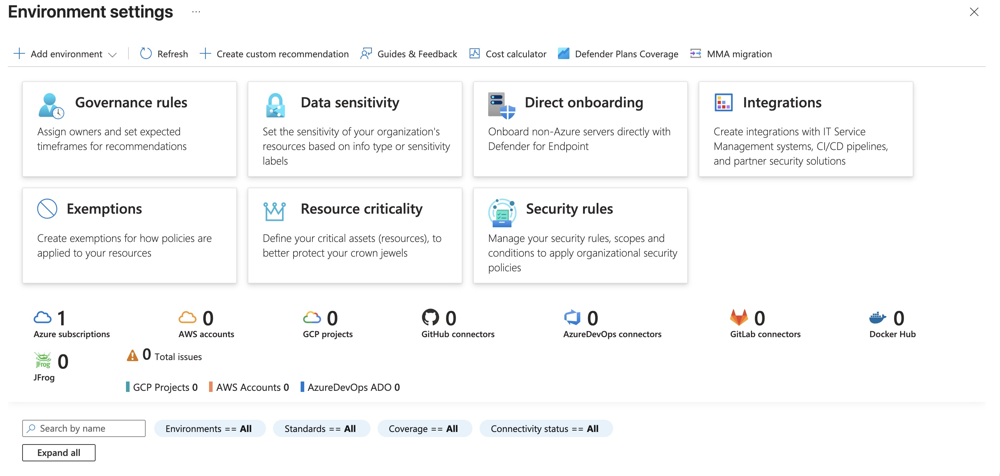

# Compliance standards in Defender for Cloud

Compliance standards in Defender for Cloud represent industry, regulatory, and organizational guidelines used to assess resource configurations across your cloud environment.

Regulatory compliance standards reflect frameworks from industry programs and government regulations. 

* **NIST SP 800-53**: for federal systems.
* **ISO 27001:** for information security management.
* **PCI-DSS:** for payment card data.
* **DORA:** for financial resilience
* **EU AI Act** for artificial intelligence 


## The Microsoft Cloud Security Benchmark

A compliance standard consists of multiple compliance controls logical groups of related security recommendations. Each control represents a specific security requirement from the standard.


###  Azure and Defender portals


The Azure portal at `portal.azure.com` serves as the configuration hub for compliance standards. You assign standards to subscriptions, configure scope, manage underlying Azure policies, and create custom standards in the Azure portal. To manage standards and access the full compliance dashboard, **Resource Policy Contributor** and **Security Admin** roles are required at minimum.

**The Defender portal** at `security.microsoft.com` provides the monitoring interface for compliance status. You view compliance scores, examine control details, filter security recommendations by framework, and track remediation progress in the Defender portal. This portal offers read-only access to compliance data, making it ideal for security operations teams who monitor compliance without managing policy assignments.


Assigning compliance standards is only the first step in building a compliance program. The real work begins when you investigate which controls are passing, which are failing, and what actions you must take to close the gaps. 


The regulatory compliance dashboard provides a centralized view of your organization's compliance posture across all assigned standards. You access the dashboard through the Defender portal at `https://security.microsoft.com` by navigating to **Cloud security > Regulatory compliance**.

### Investigating a failing assessment

The following diagram shows the full investigation path from opening the dashboard to verifying a remediated control.


!!! note "Note"

    Compliance assessments run approximately every 12 hours. After remediating a failing control, wait for the next assessment cycle before the compliance dashboard reflects the updated status.
    
    
## Assigning standards and communicating compliance posture.

How to assign other standards and integrate cloud infrastructure compliance data with Microsoft Purview Compliance Manager.


### Assign compliance standards in the Azure portal

**Standard assignment and policy configuration happen in the Azure portal not the Defender portal**. The Defender portal provides a read-only view of compliance data, but you manage which standards to monitor through the Azure portal's security policy interface.

### To assign a standard:

* Sign in to the [Azure portal](https://portal.azure.com/) and open Microsoft Defender for Cloud.
* Select **Regulatory compliance**, then choose **Manage compliance policies**.



* Select your subscription or management group.
* Navigate to **Security policies**.
* Locate the standard you want to enable and toggle the status to **On**.

Standard assignment follows Azure Policy's scope hierarchy. When you assign a standard at a management group level, all nested subscriptions inherit the assignment and contribute to aggregate compliance tracking.

## Microsoft Purview Compliance Manager

Is a solution that helps organizations automatically assess and manage compliance across their multicloud environments. 

The **security team** configures standards and remediates findings in Defender for Cloud, while the legal and compliance team manages improvement actions and status in **Compliance Manager**. 

Compliance Manager aggregates data from Microsoft 365, endpoints, cloud infrastructure, and on-premises systems into a single compliance view. 


### Assign and manage Azure built-in roles

| Step | Action |
| ---- | ---- |
| Identify the scope | Determine the narrowest scope where the user or workload needs access (resource, resource group, subscription, or management group)|
| Select the role | Choose the most specific built-in role that grants required permissions without excess privileges |
| Verify existing access | Check what permissions the user or managed identity from inherited or group-based assignments |
| Assign the role | Add the role assignment at the target scope using the Azure portal, CLI, or infrastructure as code |
| Remove broader assignments | Delete any over-permissioned assignments that the new, narrower assignment replaces |

**Three general roles exist**:

| Role | What it grants | When to use it |
| ---- | ---- | --- |
| Owner | Full control including role assignment delegation | Only when the user explicitly needs to assign roles to other users or managed identities |
| Contributor | Full resource management without role assignment capability | Only when no service-specific role exists for the required operations |
| Reader | Read-only access across the scope | Audit, monitoring, and view-only scenarios where no modifications are needed |

**Azure provides two types of managed identities**:

* **A system-assigned managed identity**: Is tied to the resource's lifecycle when you delete the virtual machine, function app, or container instance, Azure automatically deletes the identity.
* **A user-assigned managed identity**: Use user assigned identities when multiple resources need identical permissions, or when the identity needs to persist after you replace or recreate the underlying resource.

!!! tip 

    Use the Access control (IAM) → Role assignments tab at the subscription scope and filter by "Type: User" to see all direct user assignments across the subscription. Sort by "Role" to quickly identify all Owner and Contributor assignments that need review.


**Example**: Assign Virtual Machine Contributor to a network engineer at resource group scope:

1. Navigate to the resource group in the Azure portal
2. Select Access control (IAM) → + Add → Add role assignment
3. On the Role tab, search for and select Virtual Machine Contributor
4. On the Members tab, select User, group, or service principal → search for the engineer's account
5. Select Review + assign
6. Return to Access control (IAM) → Role assignments to verify the new assignment appears

	If the engineer previously had Contributor at subscription scope, remove the over-broad assignment:
8. At the subscription scope, navigate to Access control (IAM) → Role assignments
9. Find the engineer's existing Contributor assignment
10. Select the assignment → Remove

### Azure custom role structure

Azure RBAC custom roles use JSON definitions that specify exactly which operations are permitted or denied. Each property controls a different aspect of access.

```json
{
  "Name": "ByteSoft VM Operator",
  "IsCustom": true,
  "Description": "Can restart and view logs for Azure VMs. Cannot create, delete, or modify VMs.",
  "Actions": [
    "Microsoft.Compute/virtualMachines/read",
    "Microsoft.Compute/virtualMachines/restart/action",
    "Microsoft.Insights/diagnosticSettings/read",
    "Microsoft.OperationalInsights/workspaces/read"
  ],
  "NotActions": [],
  "DataActions": [
    "Microsoft.KeyVault/vaults/secrets/getSecret/action"
  ],
  "NotDataActions": [],
  "AssignableScopes": [
    "/subscriptions/xxxxxxxx-xxxx-xxxx-xxxx-xxxxxxxxxxxx"
  ]
}
```

The **Actions** property lists control plane operations—creating, reading, modifying, or deleting Azure resources through Azure Resource Manager (ARM). These operations manage the resource itself, not the data inside it. In the example, `Microsoft.Compute/virtualMachines/read` allows viewing VM properties, and `restart/action` enables the restart operation.

**NotActions** creates exclusions from the Actions list.

**DataActions** controls data plane operations reading or writing data within a resource.

**NotDataActions** works like `NotActions` but applies to data plane permissions. It subtracts specific data operations from broader DataActions grants.

**AssignableScopes** defines where this role can be assigned the management groups, subscriptions, or resource groups that can use this custom role.

## Create a custom Azure role through the portal

* Go to the subscription or management group where you want to create the role, then select **Access control (IAM)** from the left menu.
* Select **+ Add** at the top of the page, then choose **Add custom role** from the dropdown.
* On the **Basics** tab, enter the role name and description. Choose whether to start from scratch, clone an existing built-in role, or upload a JSON file.
* On the Permissions tab, select **+ Add permissions** to search for and add specific actions from the available resource providers. Switch to the **JSON** tab to edit the role definition directly if you prefer working with the raw structure.
* On the **Assignable scopes** tab, verify the scopes where the role can be assigned. By default, this includes the current subscription.
* On the **Review + create tab**, review the complete role definition, and select Create to save it.

## Microsoft Entra custom roles a different system

Azure RBAC custom roles control access to Azure resources like VMs and storage accounts. Microsoft Entra custom roles control an entirely separate domain directory operations in Microsoft Entra ID.

**Microsoft Entra roles manage:**

* Users
* Groups
* Applications
* Conditional Access policies
* Directory settings. 


| Characteristic | Azure RBAC custom role | Microsoft Entra custom role |
| --- | --- | --- |
| Controls access to | Azure resources (VMs, storage, subscriptions) | Entra ID directory objects (users, groups, apps) |
| Created in | Azure portal (IAM) or ARM/Bicep templates | Microsoft Entra admin center |
| Permission source | Azure resource provider action namespaces | Microsoft Entra directory permission set |
| Assignable scope | Management group, subscription, resource group, or individual resource | Tenant-wide or specific application registration |
| Maximum custom roles per tenant | 5,000 | 100 |


### CIEM for identity insights

Cloud Infrastructure Entitlement Management (CIEM) is a security discipline that discovers, analyzes, and governs identity permissions across cloud environments to enforce least-privilege access and reduce breach risk. CIEM platforms consolidate visibility into all cloud identities and entitlements in a single dashboard, helping organizations manage access across AWS, Azure, and Google Cloud.


