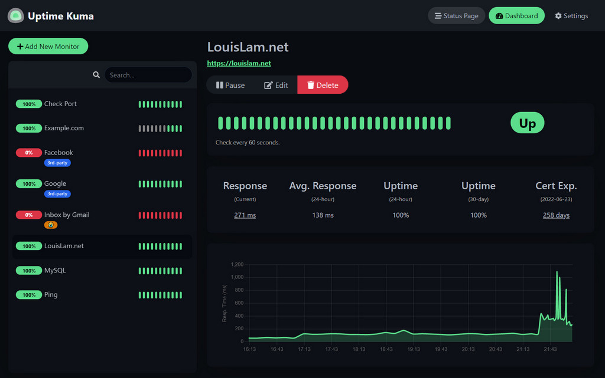

# Building my self-hosted monitoring tool

As part of my home lab / personal security stack, I wanted visibility into my own infrastructure if a service goes down or becomes unreachable, I want to know before a customer does (Availability principle). 

[Uptime Kuma](https://uptimekuma.co/) is an easy-to-use self-hosted monitoring tool, so I used it to build my own external monitoring and alerting pipeline.



## Step 1: Uptime Kuma on Proxmox (the core piece)

Proxmox has a library of community scripts that build a ready-to-use LXC container (a lightweight VM) with Uptime Kuma already installed. This saves me time from manually installing Debian, Node.js, etc.

1. Proxmox web UI → click your node → Shell (top right)
2. Paste and run:

```bash
bash -c "$(wget -qLO - https://github.com/community-scripts/ProxmoxVE/raw/main/ct/uptimekuma.sh)"
```

Before I hit enter, a quick note on trust; and one I apply to every script I run on infrastructure I care about: this pulls a script from GitHub and executes it directly. It's a well-known, widely-used community project (thousands of stars, transparent source), but as a security-minded practice I always treat "curl/wget into bash" one-liners as something to verify first.  The same instinct I'd apply to any third-party binary or supply-chain dependency.

3. Answer its prompts (default settings are fine)
4. It builds the LXC + installs Uptime Kuma + gives me a URL at the end

**Note**: At the end, it prints something like:

```bash
Uptime Kuma should be reachable by going to the following URL.
http://192.168.x.x:3001
```

I copy that IP down; I'll need it in the next step.

Once that finishes, I opened `http://<that-ip>:3001` in my browser it showed me an Uptime Kuma setup screen asking me to create an admin **username/password**. 


**Why I chose SQLite?**

* Uptime Kuma is a lightweight monitoring tool a handful of monitors pinging every 60s. 
* SQLite needs zero setup, no separate database container, no credentials to manage, no extra service that can itself become an additional attack surface or point of failure.
* One less moving part = one less thing to secure, patch, and monitor (ironic to add a whole database server to a tool whose job is watching for things breaking).
* Backups are just copying one file (`kuma.db`), which also makes it trivial to include in my regular backup/recovery routine.

## Step 2: I set up Telegram notifications

I wanted alerts pushed to me in near real time rather than having to check a dashboard, so I wired Uptime Kuma into Telegram as my out-of-band notification channel.

### Step 2.1: I find and open BotFather

* On Telegram I tap the search and type: `BotFather`
* I look for the one with the blue verified checkmark official username is exactly `@BotFather` (I watch out for fake lookalikes without the checkmark, since impersonation of BotFather is a known phishing vector)
* I tap it to open the chat

### Step 2.2: I start the conversation

* I type `/start` and send it
* BotFather replies with a menu of commands it understands

### Step 2.3: I create my bot

* I type `/newbot` and send it
* I follow the instructions (it asks for a display name, then a username ending in `bot`)

### Step 2.4: I get my token

If the username is available, BotFather replies with a success message containing something like:

```bash
Use this token to access the HTTP API:
123456789:ABCdefGHIjklMNOpqrsTUVwxyz
```


### Step 2.5: I send my bot a message

* In Telegram, I search for the username I just gave my bot
* I open the chat with it


### Step 2.6: I get my chat_id

* I open a browser (on my phone or laptop, doesn't matter)
* I go to this URL, replacing `<TOKEN>` with my actual bot token from before:

```bash
https://api.telegram.org/bot<TOKEN>/getUpdates
```

* For example, if my token is `123456789:ABCdefGHIjklMNOpqrsTUVwxyz`, the URL would be:

```html
https://api.telegram.org/bot123456789:ABCdefGHIjklMNOpqrsTUVwxyz/getUpdates
```

* I get back a block of JSON. I look for the `"chat"` object inside `result[0].message.chat` the number next to `"id"` there is my chat_id, e.g. `"chat":{"id":987654321, ...}`. I copy that number.

### Step 2.7: I add the Telegram notification in Uptime Kuma

* I open Uptime Kuma in my browser: `http://<your-lxc-ip>:3001`
* I log in with the admin account I created
* I click my profile icon (top right) → Settings
* In the left menu, I click Notifications
* I click Setup Notification (or the "+ New" button)

### Step 2.8: I fill in the notification form

* **Notification Type** → I select Telegram from the dropdown
* **Friendly Name** → anything, e.g. Telegram Alerts
* **Bot Token** → I paste my token (the `123456789:ABCdef...` string)
* **Chat ID** → I paste my chat_id number
* Toggle **"Apply on all existing monitors"** → I turn this ON (so any monitor I already made, or make later, uses it automatically saves me re-adding it each time)

### Step 2.9: I test it

* I click the **Test** button before saving
* I check my Telegram, I get a message from my bot within a few seconds, something like "Uptime Kuma Alert Testing"
* I save

## Step 3: I add monitors in Uptime Kuma

I add two monitors to start: one checks if my cloud itself is responding, the other checks if my whole VPS is reachable at all. Having both matters: it tells me what broke and from a security standpoint, an unexpected reachability change on either one is also a useful early signal of something worth investigating (misconfiguration, outage, or otherwise).

### Monitor 1: my cloud (HTTPS check)

* In Uptime Kuma, I click **+ Add New Monitor**
* Monitor Type → **HTTP(s)**
* Friendly Name → **MyCloud**
* URL → my cloud's address, e.g. `https://my-domain.com`
* Heartbeat Interval → **60 (seconds)**
* Retries → **2** (avoids a false alert on one blip)
* Heartbeat Retry Interval → **30**
* I scroll to Notifications → I make sure my Telegram notification toggle is ON (it should be, since I applied it to all monitors)
* I click Save

### Monitor 2: Server reachability (TCP/Ping check)

* I click **+ Add New Monitor** again
* Monitor Type → **TCP Port** (or Ping — TCP on port 22 is usually more reliable since some hosts block ICMP ping)
* Friendly Name → **MyServer** (SSH port)
* Hostname → my server's IP address
* Port → **22**
* Same interval/retry settings as above
* I save

### Testing


Easy to set up, and now I know when something is happening with my services pushed directly to my mobile phone.
